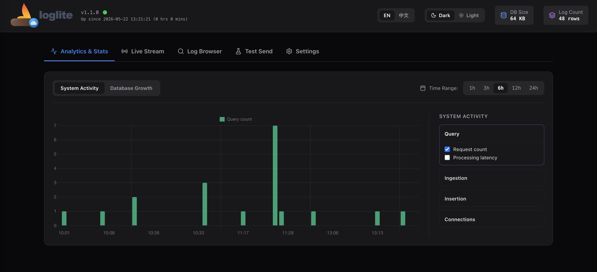

# LogLite UI

React dashboard for LogLite: live log streaming, historical queries, stats, settings, and a test panel. It talks to the LogLite HTTP API (C++ or Python backend).



## Prerequisites

- **Node.js** 22+ (matches the production Docker build)
- A running LogLite backend on port **7788** (default)

## Getting started

```bash
cd frontend
npm ci
npm run dev  # open `http://localhost:5173` in browser
```

Optional local overrides: create `frontend/.env`:

```env
VITE_API_BASE_URL=http://localhost:7788
```

If unset, dev falls back to `http://localhost:7788` via `vite.config.ts`.

## Scripts

| Command                  | Purpose                                               |
| ------------------------ | ----------------------------------------------------- |
| `npm run dev`            | Vite dev server with API proxy                        |
| `npm run build`          | Typecheck (`tsc -b`) and production bundle to `dist/` |
| `npm run preview`        | Serve the production build locally                    |
| `npm run lint`           | ESLint + Prettier check                               |
| `npm run format`         | Prettier write (config: `.prettierrc.json`)           |
| `npm run analyze-bundle` | Build with bundle visualizer (`dist-analyze/`)        |

## Stack

React 19, TypeScript, Vite 8, Tailwind CSS v4, TanStack Query, Chart.js (`react-chartjs-2`), lucide-react.

## Production image

Built from the repo root:

```bash
docker build -f dockerfiles/Dockerfile.frontend -t loglite-ui frontend
```

The image serves `dist/` with nginx and proxies API traffic to `BACKEND_URL` (default `http://backend:7788`). CI publishes multi-arch images as `ghcr.io/<owner>/loglite-ui:<tag>` on version tags.
